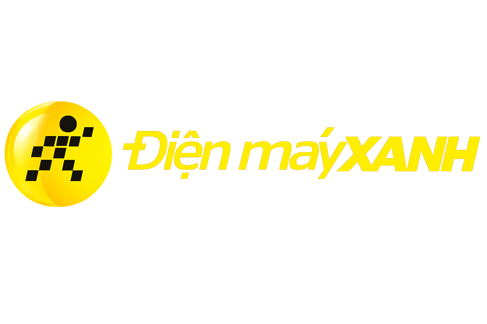

<p align="center">
  
</p>

# NEOAI
> Trợ lý AI ví như 1 bạn sale so sánh và tư vấn sản phẩm theo nhu cầu thật của khách hàng


## 🧩 Vấn đề (Problem)

Điện Máy Xanh có số lượng lớn sản phẩm thuộc nhiều ngành hàng (điện thoại, laptop, tivi, máy lạnh, tủ lạnh, gia dụng...), mỗi sản phẩm lại có nhiều thông số, mức giá, khuyến mãi và điều kiện sử dụng khác nhau. Khi mua hàng, phần lớn khách hàng không thực sự muốn biết sản phẩm nào có nhiều thông số hơn — họ cần biết sản phẩm nào phù hợp với hoàn cảnh của mình, đáp ứng đúng ngân sách, nên ưu tiên gì và phải đánh đổi điều gì giữa các lựa chọn. Trải nghiệm hiện tại vẫn buộc khách phải tự tìm kiếm, đọc bảng thông số, dùng bộ lọc hoặc hỏi nhân viên — đặc biệt khó với khách không rành công nghệ.

Chatbot hiện tại của ĐMX cũng là **AI-enabled chứ chưa phải AI-native**: là SaaS bên thứ ba (geteasy.ai) dùng chung cho nhiều nhà bán lẻ khác, backend tách biệt hoàn toàn khỏi catalog/CRM/order gốc — gỡ widget đi thì trang web vẫn chạy bình thường.

## 💡 Giải pháp (Solution)
|  | Tính năng | Tóm tắt |
|---|---|---|
| 💬 | **Tư vấn như một nhân viên sale** | Hỏi đúng điều cần hỏi, từng câu một, không dồn dập — chỉ sau vài câu trao đổi tự nhiên là hiểu đúng ý khách, không bắt khách tự đọc bảng thông số |
| 🎯 | **Gợi ý đúng nhu cầu và giá trị mong muốn** | Hiểu đúng ngân sách, hoàn cảnh sử dụng và ưu tiên của khách trước khi gợi ý — đề xuất sản phẩm đáng đồng tiền, lấy thẳng từ kho hàng và bảng giá thật của nền tảng bán lẻ, không có sản phẩm ảo, không đoán mò |
| ⚡ | **Thấy sản phẩm ngay khi đang trò chuyện** | Sản phẩm hiện ra ngay trong lúc AI đang trả lời, không phải chờ AI "gõ" xong cả đoạn văn mới thấy |
| ⚖️ | **So sánh sản phẩm chỉ với 1 cú chạm** | Chọn vài sản phẩm ưng ý, AI so sánh giúp ngay — ưu nhược điểm rõ ràng, nói chuyện như nhân viên tư vấn thật, không phải bảng thông số khô khan |
| 🛡️ | **Không bao giờ bịa thông tin** | Thiếu giá hay thông số thì nói thẳng "chưa có dữ liệu" — tuyệt đối không tự đoán hay nói sai để chốt đơn |
| 📈 | **Gợi ý nâng cấp đúng lúc, không ép mua** | Thỉnh thoảng gợi ý thêm 1 lựa chọn nhỉnh hơn nếu thực sự đáng số tiền chênh lệch — không lặp lại, không làm phiền nếu khách đã từ chối |

## 🎯 Đối tượng sử dụng (Target User)

- **Khách hàng mua sắm điện máy** tại Điện Máy Xanh — bao gồm cả người không rành công nghệ, không biết thuật ngữ kỹ thuật, hoặc đang mua hộ/mua tặng người khác. Phạm vi demo hiện tại tập trung vào ngành hàng **máy lạnh** và **tủ lạnh**.
- **Đội ngũ sản phẩm/CX** — làm nền chứng minh hướng đi AI-native buying assistant, thay thế lớp chatbot SaaS bên thứ ba tách biệt khỏi catalog thật hiện tại.

## 🛠️ Tech Stack


**Backend & AI**

| Badge | Mô tả |
|---|---|
|  | Agent framework điều phối pipeline (slot-filling, retrieval, ranking, streaming) |
|  | Structured output (`generateObject`) + streaming text qua `Agent.stream()` |
|  | LLM chính, gọi qua endpoint OpenAI-compatible (FPT Cloud MKP) |
|  | Embedding model cho vector search (RAG) |
|  | Validate structured output từ LLM |
|  | Runtime cho Mastra server |

**Database & Auth**

| Badge | Mô tả |
|---|---|
|  | Serverless Postgres — catalog, session, conversation state |
|  | Schema + migration type-safe |
|  | Vector index (`product_embeddings`, `policy_embeddings`) qua `@mastra/pg` + `@mastra/rag` |
|  | Email/password auth, session, Drizzle adapter |

**Frontend**

| Badge | Mô tả |
|---|---|
|  | UI library |
|  | Build tool & dev server tốc độ cao |
|  | Type safety toàn bộ codebase |
|  | Styling utility-first |
|  | Primitive UI không style sẵn (dialog, sheet, popover...) — nền cho bộ component kiểu shadcn |
|  | Routing + protected routes |
|  | Animation (card enter/exit/re-rank, typing indicator) |

**DevOps & Deployment**

| Badge | Mô tả |
|---|---|
|  | Hosting frontend (`apps/web`, custom domain qua Wrangler) |
|  | Task orchestration + remote cache cho monorepo |
|  | CI: lint, typecheck, build trên mỗi PR/tag |

## 🧭 Phạm vi hiện tại & Lộ trình Pilot (Current Scope & Roadmap)

**Đã chạy thật, test end-to-end trên browser thật** (không phải mockup/slideshow): tư vấn hội thoại + so sánh sản phẩm cho 2 ngành hàng — **tủ lạnh** (1.692 sản phẩm, có giá thật) và **máy lạnh** (1.039 sản phẩm, catalog thật, đang chờ bổ sung giá).

**Điều kiện pilot đề xuất**: chọn 1 ngành hàng thử nghiệm (máy lạnh hoặc tủ lạnh), dữ liệu catalog/giá/tồn kho/chính sách đã làm sạch từ đối tác, chạy thử 1.000–10.000 hội thoại trong 3 tháng.

## 👥 Thành viên (Team)

| Họ tên |
|---|
| Mai Huy Hoàng|
| Lê Hữu Khoa |
| Võ Trọng Tiển|
| Đỗ Như Trọng |
| Lâm Tiến Thăng|
| Đàm Mạnh Dũng|


## 🚀 Quick Start

### 1. Cài đặt dependencies

Yêu cầu **pnpm 10.16.1** (khai báo ở `packageManager`) và Node ≥ 22.

```bash
pnpm install
```

### 2. Biến môi trường

Có 2 app cần file `.env` riêng:

```bash
cp apps/api/.env.example apps/api/.env
cp apps/web/.env.example apps/web/.env
```

`apps/api/.env` cần điền: `BETTER_AUTH_SECRET` (generate bằng `openssl rand -base64 32`), `DATABASE_URL` (Neon Postgres pooled connection), `A_OPENAI_API_KEY` + `A_OPENAI_BASE_URL` (LLM chat qua FPT Cloud), `OPENAI_API_KEY` (embedding). `apps/web/.env` chỉ cần `VITE_ADVISOR_API_URL` (mặc định `http://localhost:4111`, khớp port backend bên dưới).

### 3. Khởi tạo & seed database

```bash
pnpm --filter api db:generate   # sinh migration từ src/db/schema.ts
pnpm --filter api db:migrate    # áp migration vào Neon

# Seed script mặc định chạy dry-run — thêm CONFIRM_SEED=yes để ghi thật (tốn phí embedding)
pnpm --filter api seed:products
pnpm --filter api seed:policy
```

### 4. Chạy Backend và Frontend

```bash
pnpm dev
```

- Frontend: [localhost:5173](http://localhost:5173)
- Backend: [localhost:4111](http://localhost:4111)

Chạy riêng từng app khi cần: `pnpm --filter web dev` hoặc `pnpm --filter api dev`.

## 📂 Project Structure

```
neoai/
├── apps/
│   ├── web/                    # React 19 + Vite frontend, deploy Cloudflare Workers
│   │   └── src/
│   │       ├── components/
│   │       │   ├── advisor/    # Chat + results panel thật (RealChatPanel, RealResultsPanel...)
│   │       │   ├── storefront/ # Trang sản phẩm máy lạnh (hero, carousel, grid, compare, chat sidebar)
│   │       │   ├── ai-elements/# Primitive UI cho chat streaming (conversation, message, prompt-input)
│   │       │   └── ui/         # Radix/shadcn-style base components
│   │       ├── auth/           # Better Auth client + trang login/register
│   │       └── lib/            # API client (advisor/products/compare), hooks, utils
│   ├── api/                    # Backend Mastra (Hono bên trong)
│   │   ├── src/
│   │   │   ├── mastra/
│   │   │   │   ├── advisor/    # SPIN slot-filling + hybrid retrieval + WSUM ranking pipeline
│   │   │   │   ├── products/   # Product listing (phân trang) + compare (fetch-by-id, 1 LLM call)
│   │   │   │   ├── agents/     # Định nghĩa Mastra Agent (advisor, compare, conversation)
│   │   │   │   └── index.ts    # HTTP routes + CORS + auth
│   │   │   └── db/             # Drizzle schema + client (Neon Postgres)
│   │   └── scripts/            # Seed catalog + policy vào Postgres/pgvector
│   └── data/                   # Nguồn dữ liệu markdown (catalog, policy) dùng để seed DB
├── docs/                       # SPEC/PLAN — bối cảnh bài toán, kiến trúc, metric đánh giá
├── packages/                   # Dùng chung giữa các app (hiện trống)
├── turbo.json                  # Cấu hình task Turborepo
└── pnpm-workspace.yaml
```
