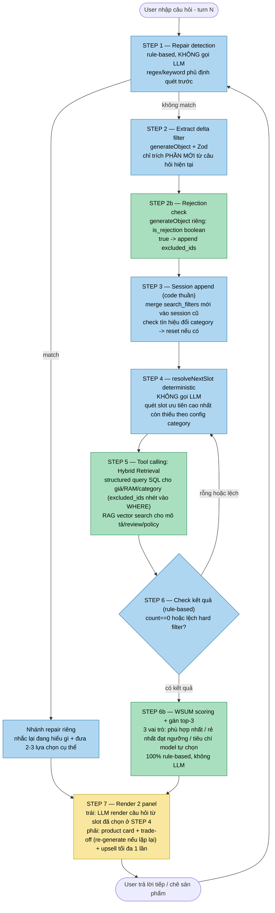

## Kỹ thuật công nghệ

**Monorepo**: Turborepo 2.10 + pnpm workspace (pnpm 10.16.1) — `apps/api` (BE), `apps/web` (FE), `packages/` hiện trống.

**Backend (`apps/api`)**:
- Framework: **Mastra** (`@mastra/core` 1.51) — server HTTP layer của Mastra dựa trên Hono bên trong (không thấy `hono` là dependency trực tiếp)
- Agent hiện có: `conversation-agent` (`src/mastra/agents/conversation.ts`) — **đang là placeholder generic** ("You are NeoAI, a concise and helpful assistant"), CHƯA có SPIN/slot schema/tool-calling/RAG/WSUM như đã thiết kế trong SPEC.md
- LLM: model id `openai/DeepSeek-V4-Flash`, gọi qua endpoint OpenAI-compatible của FPT Cloud (`OPENAI_BASE_URL=https://mkp-api.fptcloud.com`), không phải OpenAI trực tiếp
- Memory: `@mastra/memory` — giữ 20 tin nhắn gần nhất + tự generate title hội thoại; CHƯA có custom session state (search_filters/excluded_ids append) như đã note ở dưới
- DB: PostgreSQL qua Neon serverless (`@neondatabase/serverless`) + Drizzle ORM — schema (`src/db/schema.ts`) có bảng auth (user/session/account/verification) **+ bảng `products`** (catalog structured — id, title, brand, price, specs jsonb, promotions...) — **migration `0001_young_big_bertha.sql` đã apply thật lên Neon**, đã seed thử 1692 sản phẩm tủ lạnh thật từ ĐMX (`apps/api/scripts/all-products.ts`, xem chi tiết ở Paintpoint 3)
- Auth: `better-auth` + `@better-auth/drizzle-adapter`
- Observability: `@mastra/observability` có sẵn sensitive-data filter
- Route đã có: `/api/auth/*`, `/api/me`, `/api/chat` (qua `@mastra/ai-sdk` chatRoute, agent=conversation-agent) — chưa có route riêng cho search/catalog

**Frontend (`apps/web`)**:
- Vite 8 + React 19 + TypeScript, deploy qua Cloudflare Workers (Wrangler)
- Chat UI: Vercel AI SDK (`ai` + `@ai-sdk/react`) + `streamdown` (render markdown streaming, có plugin math/mermaid/code/cjk)
- Component đã có: `ai-elements/conversation.tsx`, `message.tsx`, `prompt-input.tsx` (chat 1 cột) + UI primitives Radix/shadcn — **CHƯA có component panel phải hiển thị sản phẩm** (layout 2-panel trong SPEC.md chưa build)
- Animation: **`motion`** (rebrand của framer-motion, đã thêm vào `package.json` của `apps/web`) — dùng cho hiệu ứng card xuất hiện/re-rank ở panel phải (STEP 7) khi `search_filters` đổi. Không thêm icon lib riêng (iconify) hay `react-markdown` riêng — `lucide-react` và `streamdown` đã cover đủ 2 nhu cầu đó, tránh trùng lặp dependency.

**3 công cụ nền tảng nên dùng đúng theo stack thật (thay vì tự viết tay):**
- **Mastra Workflow**: hỗ trợ sẵn việc tách step deterministic (code thuần) và step agent (gọi LLM) trong cùng 1 workflow — đúng nguyên tắc "tách quyết định khỏi diễn đạt" đã chốt nhiều lần trong SPEC.md. Khuyến nghị chính thức của Mastra: *"start with deterministic code and only introduce an agent at the specific points where human-like reasoning is required."* ([Mastra Docs — Agents and tools](https://mastra.ai/docs/workflows/agents-and-tools))
- **Vercel AI SDK `generateObject` + Zod**: ép LLM trả đúng cấu trúc JSON (search_filters, next_slot render, is_rejection...), tự validate + retry nếu sai format — không cần tự viết parser/regex để bóc JSON từ text LLM trả về.
- **`@mastra/rag`** (2.4.1, **ĐÃ THÊM vào `package.json` của `apps/api`**) — package RAG riêng của Mastra, tự triển khai toàn bộ pipeline bằng API riêng: chunking (recursive/sliding window), embedding qua `ModelRouterEmbeddingModel`, vector store abstraction dùng chung 1 interface cho nhiều backend (pgvector, Pinecone, Qdrant, MongoDB, LibSQL), `createVectorQueryTool` (biến truy vấn vector thành tool cho agent tự gọi kèm filter/rerank), có cả GraphRAG. ([Mastra Docs — RAG Overview](https://mastra.ai/docs/rag/overview), [npm @mastra/rag](https://www.npmjs.com/package/@mastra/rag?activeTab=readme))
  - **Gợi ý hạ tầng**: nên chọn **pgvector** làm vector store vì project đã sẵn Postgres qua Neon (`@neondatabase/serverless`) + Drizzle — gộp chung 1 DB cho cả catalog (structured) lẫn vector (RAG), không cần thêm service Qdrant/Weaviate riêng như từng liệt kê trong SPEC.md, đơn giản hạ tầng đáng kể cho 48h hackathon.

**Kết luận nhanh**: repo hiện là starter template (mô tả gốc trong `package.json`: "Cloudflare worker basic monorepo starter template") — hạ tầng auth/chat cơ bản đã có. **Phần catalog/seed script (bảng `products`, embedding pipeline) ĐÃ triển khai và test thật** (xem Paintpoint 3, Vấn đề nhỏ 2). Phần agent/slot schema/search pipeline (Paintpoint 1, 2 và phần còn lại của 3) **vẫn CHƯA triển khai** — agent hiện tại vẫn là placeholder generic, cần code mới.

---

## Pipeline tổng thể — RAG + Tool Calling, kèm vị trí từng Paintpoint lớn trong flow

**Chú giải màu**: 🟨 vàng = Paintpoint 1 (AI-Native, cross-cutting — không nằm ở 1 step riêng, mà là thuộc tính của cả pipeline này có tồn tại hay không; đúng litmus test đã note, gỡ pipeline này ra là chatbot sụp hoàn toàn, không phải lớp phủ) · 🟦 xanh dương = Paintpoint 2 (Hỏi mơ hồ) · 🟩 xanh lá = Paintpoint 3 (Recommend)

---

# Paintpoint 1 — Chatbot chưa phải AI-Native

Đây là paintpoint tổng quát/framing, không tách thành vấn đề nhỏ riêng — thể hiện xuyên suốt toàn bộ pipeline ở trên (xem STEP 7 — Render), không nằm ở 1 step cụ thể. Nếu làm đủ 4 tiêu chí AI-native đã note trong SPEC.md (data architecture riêng, AI có quyền ghi/hành động, quyết định nằm trong vòng lặp AI tách khỏi model, tích hợp xuyên chức năng), chatbot sẽ tự động đạt được, không cần giải pháp kỹ thuật độc lập cho riêng paintpoint này.

**Chưa có trong SPEC.md**: không có mục "Giải Pháp Kĩ Thuật" riêng cho paintpoint này (đã bị lược bớt trong 1 lần user tự sửa file) — chỉ còn litmus test + tham khảo Google AI Mode.

---

# Paintpoint 2 — User không biết hỏi gì, hỏi mơ hồ, thiếu ngữ cảnh

### Vấn đề nhỏ 1: Không biết hỏi câu gì đúng trọng tâm, dễ hỏi dồn hết 1 lần
→ **Giải quyết bằng**: SPIN + Slot schema config, tách thành **2 step riêng biệt trong Mastra Workflow**:
- **Step deterministic** (code thuần, KHÔNG gọi LLM): `resolveNextSlot(state, schema)` quét slot ưu tiên cao nhất còn thiếu, theo config JSON định nghĩa sẵn theo từng category. **Quy ước ưu tiên**: `budget` (ngân sách) luôn priority cao nhất — universal cho mọi category, vì khách vào 1 gian hàng cụ thể thường đã có sẵn khoảng ngân sách trong đầu và đây là đòn bẩy thu hẹp catalog mạnh nhất (bỏ qua nếu khách đã tự nói ngân sách trong câu đầu); `buyer_type` (dùng/tặng) priority kế tiếp, chỉ bật cho category hay mua tặng (laptop, điện thoại...) vì rẽ nhánh cả cấu trúc câu hỏi phía sau
- **Step agent** (có gọi LLM): nhận slot đã được quyết định sẵn từ step trên, chỉ render thành câu hỏi tự nhiên — không tự chọn slot. Tông giọng: gần gũi, có cá tính, không khô khan thuần túy (guideline khi viết prompt/few-shot, không đổi kiến trúc)

### Vấn đề nhỏ 2: Phải chờ đủ thông tin mới có kết quả, trải nghiệm chậm/khô khan
→ **Giải quyết bằng**: Search sớm, tinh chỉnh liên tục. Extract `search_filters` bằng **`generateObject` (Vercel AI SDK) + Zod schema** — ép LLM trả đúng cấu trúc, tự validate/retry nếu sai format, không tự viết parser JSON thủ công. Đây là step RIÊNG với step render câu hỏi ở Vấn đề nhỏ 1, search lại catalog mỗi lượt để cập nhật panel phải.

### Vấn đề nhỏ 3: Search ra kết quả rỗng/sai lệch nhưng vẫn trả lời bừa
→ **Giải quyết bằng**: Check kết quả trước khi show (retrieval evaluator rule-based) — `count(results)==0` hoặc lệch hard filter thì set `needMoreInfo=true`, chuyển hỏi thêm thay vì để LLM "chữa cháy" bằng câu trả lời chung chung.

### Vấn đề nhỏ 4: Bot hiểu sai ý khách mà không tự phát hiện/sửa
→ **Giải quyết bằng**: Repair — detect bằng regex/keyword phủ định trước khi vào LLM (`"không phải"`, `"sai rồi"`...), set `repairMode=true`, ép LLM trả lời theo đúng 2 bước: nhắc lại đang hiểu gì + đưa 2-3 lựa chọn cụ thể.
**Cần bổ sung trước khi code**: xây 1 bộ test case riêng (giống `question_lowContextFromUser.json`) liệt kê rõ câu THẬT sự là sửa lỗi hiểu sai vs câu chỉ tình cờ chứa từ phủ định trong mô tả nhu cầu bình thường (vd *"em cần máy không phải chạy êm mà cần công suất mạnh"* — đây KHÔNG phải repair) — tránh false positive trigger `repairMode` sai.

### Vấn đề nhỏ 5: AI tự quyết định hỏi gì → thiếu nhất quán qua nhiều lần chạy
→ **Giải quyết bằng**: Tách "quyết định hỏi gì" (rule/config, chính là `resolveNextSlot()` ở Vấn đề nhỏ 1) khỏi "diễn đạt câu hỏi" (LLM) — LLM không có quyền tự chọn slot để hỏi. Đây là cùng 1 cơ chế với Vấn đề nhỏ 1, không phải giải pháp riêng.

### Vấn đề nhỏ 6: Bỏ lỡ cơ hội tăng giá trị đơn hàng, hoặc mồi thêm gây khó chịu nếu làm ẩu
→ **Giải quyết bằng**: Upsell rule tìm candidate (cùng category, giá cao hơn **tối đa +10%** so với sản phẩm đang đề xuất — siết từ mức +10-20% ban đầu để giảm cảm giác bị ép mua) + diff spec tính bằng so sánh field-by-field, LLM chỉ diễn giải diff có sẵn. Giới hạn tối đa 1 lần/hội thoại, không lặp lại nếu khách từ chối.
**Cần bổ sung trước khi code**: danh sách "field đáng diff" theo từng category (giống slot schema) — không diff tất cả field mà chỉ field ảnh hưởng quyết định thật sự (RAM/CPU cho laptop, công suất/độ ồn cho máy lạnh...).

### Vấn đề nhỏ 7: Xử lý từ viết tắt, sai chính tả, thiếu dấu, từ ngữ địa phương
→ **Giải quyết bằng**: chưa có, cần bổ sung.

### Vấn đề nhỏ 8: Phát hiện đổi category giữa chừng hội thoại (vd đang hỏi máy lạnh nhảy sang hỏi tủ lạnh)
→ **Giải quyết bằng**: chỉ coi là đổi category khi từ khóa trích được là 1 category khác (tủ lạnh, máy lạnh, laptop...) — tên hãng (Panasonic, Dell...) hay thuộc tính khác luôn được hiểu là filter thêm vào category hiện tại, KHÔNG kích hoạt reset session.

---

# Paintpoint 3 — Recommend (Không biết chọn sản phẩm nào)

### Vấn đề nhỏ 1: Filter số liệu (giá, RAM, diện tích...) dễ sai lệch nếu chỉ dùng vector search/RAG
→ **Giải quyết bằng**: Hybrid retrieval — trường định lượng query có cấu trúc (SQL/filter) trực tiếp vào catalog qua tool-calling, không dùng vector search cho phần này. RAG chỉ dùng cho dữ liệu không có cấu trúc rõ (mô tả, tóm tắt review, so sánh mập mờ với đồ đang dùng, policy/FAQ).

### Vấn đề nhỏ 2: Dữ liệu catalog không có cấu trúc rõ, dễ embed sai cách làm loãng vector
→ **Giải quyết bằng**: Quy tắc chia field khi đưa vào vector DB — field text/mô tả ghép thành 1 đoạn văn bản rồi mới embed; field số liệu VÀ field động (giá, tồn kho, khuyến mãi...) để làm metadata/cột structured đi kèm, không đưa vào text để embed (số liệu làm loãng ngữ nghĩa vector, field động khiến vector bị stale khi dữ liệu đổi); không nhúng nguyên JSON thô cả sản phẩm.

**ĐÃ TRIỂN KHAI THẬT** — `apps/api/scripts/all-products.ts`, seed 1692 sản phẩm tủ lạnh thật từ ĐMX (`apps/data/all-products.md`), chạy 1 lần qua `bun run seed:products` (mặc định dry-run, cần `CONFIRM_SEED=yes` mới ghi thật/tốn phí OpenAI):
- Bảng `products` (Drizzle) đã tạo thật trên Neon qua migration `0001_young_big_bertha.sql`
- Vector index `product_embeddings` (PgVector qua `@mastra/rag` + `text-embedding-3-small`, 1536 chiều) — đặt tên KHÁC bảng Drizzle `products` để tránh trùng
- 3 bug thực tế đã gặp và sửa khi test (không phải lý thuyết, đây là bug thật đã chạy ra lỗi thật):
  1. **Regex frontmatter neo `^` vào đầu chuỗi** trong khi mỗi block markdown có dòng `<!-- rag-document: ... -->` đứng trước `---` → parse fail 100% (0/1692) → sửa: bỏ neo `^`, chỉ tìm `---...---` xuất hiện đầu tiên trong block
  2. **Đặt trùng tên** `VECTOR_INDEX_NAME = 'products'` với bảng Drizzle `products` (không có cột `embedding`) → PgVector tưởng bảng đã tồn tại, tạo index lên cột không có thật → lỗi `column "embedding" does not exist` → sửa: đổi tên index thành `product_embeddings`
  3. **Text embed vô tình nhúng field động** (`Khuyến mãi`) — vi phạm chính quy tắc đã đặt ra ở trên → sửa: bỏ khỏi `embeddingText`, chỉ giữ ở cột `promotions` structured
- Dữ liệu thật phát hiện được: chỉ ~15% sản phẩm (252/1692) có giá trong dataset gốc — xác nhận nguyên tắc "không tự bịa dữ liệu" (Vấn đề nhỏ 7 bên dưới) là nhu cầu thật trong dữ liệu thật, không phải giả định lý thuyết.

### Vấn đề nhỏ 3: Sản phẩm hợp lệ lặp lại qua nhiều lượt hội thoại dễ bị hiểu nhầm là lỗi/duplicate
→ **Giải quyết bằng**: Session state append theo từng lượt — LLM chỉ trích phần MỚI từ câu hỏi hiện tại, BE tự append vào `search_filters` (từ nội dung hội thoại) và `excluded_ids` qua **1 step LLM structured-output riêng biệt** (`generateObject` trả `{ is_rejection: boolean }`, tách hẳn khỏi step trích `search_filters` chính). `excluded_ids` áp trực tiếp vào điều kiện query DB (`WHERE id NOT IN`) ở STEP 5 của pipeline.

Phân biệt rõ 2 loại dedup, không nhầm lẫn:
- Loại bỏ sản phẩm bị chê (session exclusion) → xử lý ở bước query DB
- Chặn trùng giữa các slot trong CÙNG 1 response (2 slot cùng trỏ 1 product_id) → lỗi logic ranking thật, chặn ở bước gán tiering (STEP 6b — xem Vấn đề nhỏ 4)

**Không nên làm**: FE tự lọc bỏ product_id đã từng hiển thị ở lượt trước — sản phẩm hợp lệ vẫn thỏa điều kiện mới thì NÊN xuất hiện lại (đúng nguyên tắc "không đảo lộn danh sách mỗi lần tinh chỉnh"), lọc mù quáng theo lịch sử hiển thị có thể giấu mất đúng sản phẩm phù hợp nhất.

Khi sản phẩm lặp lại hợp lệ qua nhiều turn: bắt buộc re-generate explanation theo context mới (không cache lời giải thích cũ) + bot chủ động báo continuity ("mẫu này em đã gợi ý ở trên, giờ vẫn phù hợp với yêu cầu mới").

### Vấn đề nhỏ 4: Cách chọn top-3 theo 3 vai trò (phù hợp nhất/rẻ nhất/tiêu chí model tự chọn)
→ **Giải quyết bằng**: thuật toán WSUM (Weighted Sum Model) — 100% rule-based, không LLM, chạy tại STEP 6b:
1. **Chuẩn hóa**: đưa từng tiêu chí (giá, hiệu suất, độ ồn...) về cùng thang [0,1] dựa trên min/max của chính candidate pool hiện tại — tiêu chí "càng thấp càng tốt" dùng `(max-value)/(max-min)`, "càng cao càng tốt" dùng `(value-min)/(max-min)`
2. **Gán trọng số**: theo priority khách đã nêu qua SPIN (vd "ưu tiên tiết kiệm điện" → tăng trọng số tiêu chí hiệu suất năng lượng), cấu hình sẵn theo category
3. **Tính điểm tổng**: `score = Σ(norm_i × weight_i) / Σ(weight_i)`
4. **Slot 1 "phù hợp nhất"** = candidate có score cao nhất toàn pool
5. **Slot 2 "rẻ nhất đạt ngưỡng"** = trong các candidate còn lại có score ≥ ngưỡng tối thiểu (config được), chọn giá thấp nhất
6. **Slot 3 "tiêu chí model tự chọn"** = trong các candidate còn lại, tính độ chênh lệch (range) từng tiêu chí trên giá trị đã chuẩn hóa, loại các tiêu chí đã dùng làm nhãn ở Slot 1/2 (tránh lặp câu chuyện), chọn tiêu chí có chênh lệch lớn nhất làm nhãn, rồi chọn candidate tốt nhất theo đúng tiêu chí đó
7. **Validate không trùng**: check 3 slot có 3 `product_id` khác nhau — nếu candidate pool quá nhỏ khiến 2 slot trùng nhau, không ép trùng mà hiện ít hơn 3 card (graceful degradation)

### Vấn đề nhỏ 5: Khi out rank thì sao (không có sản phẩm đáp ứng toàn bộ yêu cầu)
→ **Giải quyết bằng**: chưa có, cần bổ sung — ý tưởng ban đầu là gợi ý sản phẩm gần đạt yêu cầu nhất.

### Vấn đề nhỏ 6: Truy xuất đầy đủ giá, khuyến mãi, tồn kho, review và chính sách
→ **Giải quyết bằng**: mới giải quyết 1 phần qua Hybrid retrieval (Vấn đề nhỏ 1) cho giá/tồn kho; phần khuyến mãi/chính sách cần bổ sung thêm nguồn dữ liệu và field cụ thể khi có schema catalog thật.

### Vấn đề nhỏ 7: Không tự bịa thông tin sản phẩm
→ **Giải quyết bằng**: tách theo loại claim —
- Claim định lượng (giá, thông số): rule-based so khớp trực tiếp với catalog thật, chạy live trong pipeline
- Claim định tính ("chạy êm", "dễ vệ sinh"): RAGAS/DeepEval (claim decomposition + NLI/LLM-judge) — xem mục `## Test` ở cuối file, không bắt buộc chạy đồng bộ mỗi request live vì tốn latency, phù hợp làm công cụ đo lường định kỳ hơn.

---

## Test — cần validate độc lập trước khi coi là guardrail chính thức

**Faithfulness / grounding check (claim định tính)**
- Input: câu giải thích trade-off đã sinh ra cho từng sản phẩm trong top-3 (từ STEP 7)
- Cần test: claim định tính ("chạy êm", "dễ vệ sinh") qua RAGAS/DeepEval (claim decomposition + NLI/LLM-judge) — claim định lượng đã có rule-based chạy live, không cần test riêng ở đây
- Lý do để offline, không bắt buộc chạy live mỗi request: RAGAS/DeepEval dùng NLI/LLM-judge khá tốn latency nếu chạy trên MỌI request — hợp lý hơn khi coi đây là công cụ đo lường chất lượng định kỳ (chạy trên tập test), không phải guardrail đồng bộ mỗi lượt
- Đo bằng: Faithfulness score (đã có trong Metric Nhóm 3 của SPEC.md)
